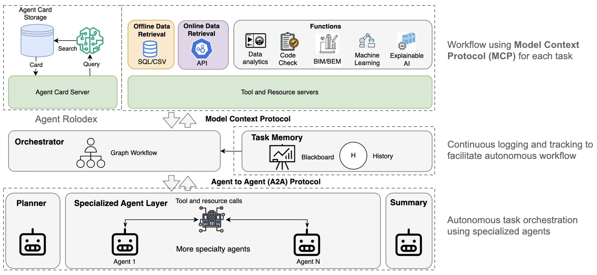

# AUTOMA-AI - Autonomous Multi-Agent Network

**AUTOMA-AI is an integration-first framework for building production-oriented agent systems from interchangeable agents, tools, memory stores, token usage stores, checkpoints, and shared-state components.** It is designed for teams that need more than simple agent demos: persistent workflows, human checkpoints, distributed agents, and pluggable infrastructure.

AUTOMA-AI treats agent systems as **composable agent infrastructure** rather than a monolithic agent stack. Instead of requiring every component to be implemented as a framework-specific agent, AUTOMA-AI provides protocol-driven integration points and plugin-and-play interfaces so agents, tools, retrievers, memory stores, token usage stores, blackboards, checkpointers, and model providers can be independently developed, replaced, and deployed.

> **Formerly BEM-AI:** The original building energy modeling application has moved to the example folder: [examples/sim_bem_network](examples/sim_bem_network).

## What is AUTOMA-AI?

AUTOMA-AI is an open-source framework for building stateful, long-running workflows powered by modern language models such as OpenAI/ChatGPT, Azure OpenAI, Google GenAI/Gemini, Claude-compatible interfaces, AWS Bedrock, and local models such as Ollama.

The framework helps turn LLMs from simple chat interfaces into task-oriented agents that can plan, reason, use tools, collaborate with other agents, and interact with external systems. AUTOMA-AI is especially focused on production-oriented agent systems where teams need clear integration boundaries, persistent state, traceable artifacts, and deployment flexibility.

Out of the box, AUTOMA-AI supports:

- **Agents** that can run locally or be exposed as remote services.
- **Skills and workflows** for structured task execution.
- **Tool and API integration** through the AUTOMA-AI tool interface and MCP.
- **Retrieval pipelines** for grounding responses in project or domain data.
- **Memory stores** for session and long-term context.
- **Shared blackboard state** for structured intermediate artifacts.
- **Checkpointing** for resumable workflows.
- **Multi-agent collaboration** through local delegation and protocol-based A2A communication.

## Why AUTOMA-AI?

Many agent frameworks are optimized for quickly defining agents, tools, tasks, graph flows, or provider-native agent workflows. Those approaches are useful and often the right choice. Production applications, however, often require an additional integration layer:

- Agents may need to run as independently deployed services.
- Tools may come from local Python functions, REST APIs, or MCP servers.
- Memory may need to use SQLite, Chroma, DynamoDB, Redis, or cloud-native stores.
- Workflows may need pause/resume, human approval, validation gates, and traceable intermediate outputs.
- Applications may need to swap model providers without rewriting orchestration logic.

AUTOMA-AI focuses on these requirements by decoupling orchestration logic from infrastructure choices. The framework provides standard interfaces and protocol-based integration points so teams can assemble the agent system that fits their application rather than adopting a single fixed stack.

## Core architecture

### Agents

Agents are the main reasoning and execution units. They can be initialized through AUTOMA-AI factories, implemented as local Python objects, or exposed as remote A2A-compatible services. This allows teams to start simple and later distribute agents across services when the application requires it.

### Skills

Skills package reusable task instructions, completion criteria, and output expectations. They provide a structured layer between a general-purpose LLM and low-level tools, making it easier to reuse task logic across applications.

### Tools and MCP

AUTOMA-AI supports both its native tool interface and Anthropic's Model Context Protocol (MCP). Tools can be local functions, configured built-in tools, or external MCP servers. This allows tool implementations to evolve independently from the agent orchestration layer.

### A2A agent collaboration

AUTOMA-AI supports protocol-first collaboration through Google A2A. Agents can collaborate locally or through remote A2A servers. A2A is an integration option, not a requirement: users can create AUTOMA-AI agents directly when a local in-process workflow is sufficient, and expose agents as services when distributed deployment is needed.

### Blackboard/shared state

The shared blackboard is a key AUTOMA-AI concept. Agents can write structured artifacts to shared state instead of relying only on chat history. This is intended to reduce token pressure, create a clearer source of truth, improve traceability, and make long-running workflows easier to inspect and resume.

### Memory stores

AUTOMA-AI provides memory abstractions so implementations can be swapped based on application needs. A prototype may use an in-memory or local store, while a production system may use a database or cloud-native backend such as DynamoDB.

### Checkpointing

Checkpointing supports stateful, long-running workflows by preserving execution state. AUTOMA-AI includes configurable checkpointer support, including in-memory and Redis-backed options, so workflows can be resumed and deployed more reliably.

### Model providers

AUTOMA-AI provides model provider abstractions for multiple LLM hosts, including cloud models and local models. The goal is to keep application orchestration separate from the selected model endpoint.

### Retrievers

Retriever interfaces support grounding agents in external data. Providers can be registered by name or supplied through custom implementations, enabling application-specific retrieval backends.

## Key differentiators

AUTOMA-AI's differentiator is not any single feature such as A2A, MCP, memory, tools, retrieval, or skills. Its differentiator is the integration of these ideas into a provider-neutral, protocol-aware, interface-first framework for stateful scientific and engineering workflows.

### 1. Protocol-first agent collaboration

AUTOMA-AI supports open protocols such as Google A2A for agent-to-agent collaboration and MCP for tool integration. The framework does not require every component to be an AUTOMA-AI-specific class. Agents and tools can be local, remote, independently deployed, and reused outside a single application.

### 2. Plugin-and-play interfaces

AUTOMA-AI is designed around replaceable interfaces rather than one fixed implementation. Examples include:

- Tool interface
- MCP tool integration
- Memory store interface
- Blackboard/shared-state interface
- Checkpointer interface
- Model provider abstraction
- Retriever interface

This makes it possible to swap implementations such as SQLite, Chroma, DynamoDB, Redis, AWS services, local tools, MCP servers, OpenAI, Azure OpenAI, Bedrock, Ollama, and other providers without redesigning the entire workflow.

### 3. Stateful, long-running workflows

AUTOMA-AI is built for workflows that require persistence, pause/resume, validation checkpoints, human review, and traceable intermediate artifacts. The shared blackboard allows agents to coordinate through structured state instead of passing everything through conversational context.

### 4. Production application foundation

AUTOMA-AI is intended to serve as a foundation for real PNNL applications, including BEM-AI and PermitCE. It is production-oriented in its architecture, while the package, documentation, APIs, and community ecosystem are still evolving.

## How AUTOMA-AI is different

AUTOMA-AI is not intended to replace every agent framework. It optimizes for a different center of gravity: provider-neutral, protocol-aware, plugin-and-play infrastructure for stateful workflows and production application integration.

| Framework / ecosystem | Strong fit | AUTOMA-AI distinction |
| --- | --- | --- |
| CrewAI and role-based multi-agent frameworks | Quickly defining role-based agents, tasks, crews, and flows with approachable onboarding | AUTOMA-AI emphasizes protocol-based collaboration, shared blackboard state, and replaceable infrastructure interfaces for deeply integrated applications |
| LangGraph | Fine-grained, stateful graph execution and controllable agent workflows | AUTOMA-AI can build on LangGraph while adding higher-level application interfaces for agents, skills, tools, retrievers, blackboards, model providers, and A2A collaboration |
| AutoGen | Flexible multi-agent conversation patterns involving LLMs, tools, code, and human input | AUTOMA-AI places more emphasis on structured workflow artifacts, shared state, and production integration boundaries |
| Semantic Kernel and enterprise integration frameworks | Enterprise application integration, plugins, planners, memory, and cloud/provider ecosystem alignment | AUTOMA-AI aims to remain provider-neutral and infrastructure-pluggable across model hosts, memory stores, tools, retrievers, and deployment backends |
| LlamaIndex / Haystack-style data and RAG frameworks | Data-centric LLM applications, document pipelines, retrieval, and knowledge-grounded workflows | AUTOMA-AI treats retrieval as one replaceable component inside a broader stateful multi-agent workflow architecture |
| OpenAI Agents SDK / Claude Agent SDK / Google ADK | First-party agent development within specific model/provider ecosystems | AUTOMA-AI focuses on framework-composable integration across providers, protocols, and application-specific infrastructure |
| Custom application-specific agents | Maximum control for one application | AUTOMA-AI provides reusable interfaces and architectural patterns that can be shared across applications and deployment environments |

In short, AUTOMA-AI is best understood as **composable agent infrastructure** for building interoperable, stateful, production-oriented agent systems.

## When to use AUTOMA-AI

AUTOMA-AI is a good fit when your application needs:

- Multiple agents or tools that may be independently developed or deployed.
- Persistent workflow state and checkpointing.
- Human checkpoints, review steps, or validation gates.
- Shared structured artifacts across agents.
- Pluggable infrastructure for tools, memory, retrievers, models, and deployment backends.
- Integration with MCP tools or A2A-compatible agents.
- Provider-neutral integration across multiple model hosts.
- A foundation for production applications rather than a short-lived demo.

## When another framework may be enough

Another framework may be a better fit when:

- You only need a simple role-based multi-agent prototype.
- You want to stay entirely within one provider-native agent SDK.
- Your main problem is retrieval or document processing rather than workflow state and integration.
- Your workflow can be completed in one short conversation without persistent state.
- You do not need shared blackboard state, checkpointing, or remote agent collaboration.
- You prefer a larger community ecosystem and more mature onboarding materials today.

AUTOMA-AI should be adopted when its integration-first architecture is valuable, not because every project needs a full production-oriented agent stack.

## Installation

Install AUTOMA-AI from PyPI:

```bash
pip install automa-ai
```

For local development:

### Prerequisites

- Python 3.12+
- [uv](https://docs.astral.sh/uv/) package manager

### Setup

1. **Clone the repository**

   ```bash
   git clone <repository-url>
   cd BEM-AI
   ```

2. **Install dependencies using uv**

   ```bash
   uv sync
   ```

3. **Activate the virtual environment**

   ```bash
   uv shell
   ```

## Minimal quick-start example

The recommended starting point is the streaming chatbot example:

- [examples/sim_chat_stream_demo](examples/sim_chat_stream_demo)

This example shows how to bootstrap an AUTOMA-AI chatbot with streaming, tool integration, and the agent factory pattern.

## Project status and maturity

AUTOMA-AI is under active development. The project is designed for production-oriented applications, but the package is still maturing. APIs, interfaces, and examples may change as the framework evolves.

Current focus areas include:

- Stabilizing public interfaces for agents, tools, memory, blackboards, checkpointers, and retrievers.
- Improving documentation and onboarding examples.
- Expanding production deployment patterns for cloud and enterprise environments.
- Strengthening A2A and MCP interoperability.
- Supporting real PNNL applications such as BEM-AI and PermitCE.

Use in production systems should be done with care and appropriate validation.

## Technology stack

### Core dependencies

- **LangChain / LangGraph**: Agent execution, orchestration, and workflow patterns.
- **Google A2A**: Agent-to-agent communication protocol.
- **Anthropic MCP**: Tool and context protocol integration.
- **Provider-specific LLM SDKs**: Model integration across cloud and local providers.

### Development tools

- **uv**: Modern Python package management.
- **Python 3.12**: Runtime environment.

## Project structure

```text
BEM-AI/
├── examples/                           # Example engineering applications built with the framework
├── automa_ai/
│   ├── agent_test/                     # Test implementations and examples
│   ├── agents/                         # Generic agent classes
│   │   ├── react_langgraph_agent.py    # langchain/langgraph based agent
│   │   ├── agent_factor.py             # Agent factory - recommend utility to initialize an agent
│   │   ├── orchestrator_agent.py       # An agent that orchestrates the task workflow
│   │   └── adk_agent.py                # Google ADK based agent
│   ├── client/                         # Under development
│   ├── scheduler/                      # Session-scoped scheduled prompt loops
│   ├── mcp_servers/                    # MCP library
│   ├── network/                        # Network
│   ├── common/                         # Common utilities
│   └── prompts/                        # Shared prompt templates
├── pyproject.toml                      # Project configuration
├── uv.lock                             # Dependency lock file
└── README.md                           # This file
```

## Architecture



Core concepts include:

- **Orchestrator**: Assembles and coordinates workflow execution.
- **Task memory**: Maintains conversation history and shared blackboard state.
- **Planner**: Helps decompose and plan complex workflows.
- **Summary**: Produces concise workflow or conversation summaries.
- **Specialized agents**: Domain-specific agents for focused tasks.
- **Agent card service**: Stores and retrieves agent metadata for discovery.
- **Tools and resources**: External tool and resource access through native tools and MCP servers.

For the architectural north star, see [docs/architecture.md](docs/architecture.md).

## Configuration

Project configuration is managed through `pyproject.toml` and runtime configuration objects. Key configuration areas include:

- **Dependencies**: Core and development packages.
- **Build system**: uv-based build configuration.
- **Project metadata**: Version, description, and author information.
- **Optional packages**: Packages for UI integration and running examples.

### Default tools configuration

You can enable built-in tools directly from config using a `tools` list.

```yaml
tools:
  - type: web_search
    config:
      provider: auto
      serper:
        api_key: ${SERPER_API_KEY}
      firecrawl:
        api_key: ${FIRECRAWL_API_KEY}
      scrape:
        enabled: true
        max_pages: 5
      rerank:
        provider: opensource
        top_k: 5
  - type: run_python
    config:
      runner: local_subprocess
      timeout_s: 20
      workspace_root: .
      allow_network: false  # Import-policy toggle only; not runtime network isolation.
  - type: run_command
    config:
      profile: exploration
      timeout_s: 20
      workspace_root: .
```

Then pass this to `AgentFactory(..., tools_config=tools)` for `LANGGRAPHCHAT` agents.
See `docs/tools.md`, `examples/web_search_demo.py`, and `examples/run_python_demo.py` for runnable examples.

### Agent telemetry

`LANGGRAPHCHAT` agents can emit telemetry through a local JSONL recorder or a
project-registered custom recorder. Installed recorder entry points are loaded
only when telemetry config sets `load_plugins: true`.

```yaml
telemetry:
  enabled: true
  recorder: jsonl
  path: ./logs/telemetry.jsonl
  content_mode: metadata
```

Then pass this to `AgentFactory(..., telemetry_config=telemetry)` or include it
in a YAML agent spec. See `docs/telemetry.md` for the schema, privacy modes, and
custom recorder registry used by integrations such as AWS AgentCore adapters.

### Checkpointer configuration

`LANGGRAPHCHAT` agents can be configured with an explicit checkpointer backend through `AgentFactory`.
The default backend is in-memory. Redis is opt-in and requires a connection URL.

There are three Redis backends:

- `redis_plain`: Uses only core Redis commands. Choose this for standard single-shard Redis-compatible deployments, including Amazon ElastiCache Redis/Valkey with cluster mode disabled.
- `redis_cluster`: Uses the AUTOMA-AI cluster-aware saver with per-thread hash-tagged keys. Choose this for Redis Cluster or Amazon ElastiCache cluster mode enabled when you want the same hot-session checkpoint behavior as `redis_plain`.
- `redis_stack`: Uses LangGraph's Redis saver and requires both RediSearch and RedisJSON support. Choose this only when your Redis deployment supports commands such as `FT._LIST` and `JSON.GET`.

Use `type: default` to force the in-memory saver explicitly.

#### `redis_plain`

```yaml
checkpointer:
  type: redis_plain
  redis_url: redis://localhost:6379
  # redis_plain does not support ElastiCache cluster mode enabled.
  # Use a single-shard Redis/Valkey target, such as cluster mode disabled
  # with replicas.
  checkpoint_ttl_seconds: 21600
  max_checkpoints_per_thread: 15
  refresh_ttl_on_read: true
  socket_timeout: 5.0
  socket_connect_timeout: 5.0
  health_check_interval: 30
  retry_on_timeout: true
```

`redis_plain` is intended for deployments where you want Redis-backed checkpoint persistence without Redis module dependencies.
This is the safest choice for plain ElastiCache Redis/Valkey deployments when cluster mode is disabled.

`redis_plain` does not support Redis Cluster mode or ElastiCache cluster mode
enabled. It runs multi-key lifecycle operations over checkpoint records, writes,
index keys, and blob keys that belong to one logical thread. Without a
hash-tagged key layout, those keys can land in different Redis Cluster hash
slots and trigger `CROSSSLOT` errors. Use a single-shard deployment with
replicas for this hot checkpoint cache.

`redis_plain` stores hot LangGraph checkpoint state, not durable application
memory. Idle keys receive `checkpoint_ttl_seconds`; active reads refresh TTLs
when `refresh_ttl_on_read` is enabled. `max_checkpoints_per_thread` is a
resume-friendly safety cap counted by distinct LangGraph `metadata["step"]`
groups, not a strict byte or raw-record cap. Use Redis/Valkey TTLs and
`maxmemory-policy` as the primary memory controls, with this cap as protection
for sessions that never go idle.

Production Redis clients should use bounded socket waits. AUTOMA-AI defaults
to `socket_timeout: 5.0`, `socket_connect_timeout: 5.0`,
`health_check_interval: 30`, and `retry_on_timeout: true`. For ElastiCache with
in-transit encryption, use `rediss://...`. If your deployment requires custom
TLS CA settings, IAM auth, or another advanced credential flow, inject a
prebuilt Redis client rather than relying only on `redis_url`.

#### `redis_cluster`

```yaml
checkpointer:
  type: redis_cluster
  redis_url: redis://cluster-configuration-endpoint:6379
  checkpoint_ttl_seconds: 21600
  max_checkpoints_per_thread: 15
  refresh_ttl_on_read: true
  socket_timeout: 5.0
  socket_connect_timeout: 5.0
  health_check_interval: 30
  retry_on_timeout: true
```

`redis_cluster` keeps the same bounded hot-session cache model and lifecycle
options as `redis_plain`, but changes the key layout so all checkpoint,
pending-write, index, and blob keys for one logical thread share a Redis
Cluster hash slot. That avoids `CROSSSLOT` failures during TTL refresh,
pruning, and thread deletion.

Choose `redis_cluster` when the deployment target is Redis Cluster or
ElastiCache cluster mode enabled. Use the cluster configuration endpoint in
`redis_url` so redis-py can discover the cluster topology.

#### `redis_stack`

```yaml
checkpointer:
  type: redis_stack
  redis_url: redis://localhost:6379
```

Then pass this to `AgentFactory(..., checkpointer_config=checkpointer)`.

At startup, AUTOMA-AI validates that the configured Redis server supports:

- `FT._LIST` for RediSearch
- `JSON.GET` for RedisJSON

If either command is unavailable, startup fails with a clear error; switch to `redis_plain` or `redis_cluster`.

#### Choosing the backend

- Choose `redis_plain` when your deployment target is standard Redis or ElastiCache cluster mode disabled and you do not specifically need Redis Stack modules.
- Choose `redis_cluster` when your deployment target is Redis Cluster or ElastiCache cluster mode enabled and you do not specifically need Redis Stack modules.
- Choose `redis_stack` only when the Redis service is known to support RediSearch and RedisJSON.
- Do not use the old ambiguous `redis` label. The backend must be selected explicitly.

### Scheduled prompt loops

AUTOMA-AI includes a session-scoped scheduler foundation for Claude-style recurring prompts.
The current implementation supports fixed intervals, task listing/cancellation primitives,
seven-day task expiry, slash-command parsing helpers, and runners for both local agents and
A2A clients.

```python
from automa_ai.scheduler import (
    LoopScheduler,
    build_local_agent_loop_runner,
    parse_interval,
)

scheduler = LoopScheduler(build_local_agent_loop_runner(agent))
scheduler.create_loop(
    prompt="check whether the simulation finished",
    interval=parse_interval("5m"),
    context_id="session-1",
)

await scheduler.run_due_tasks()
```

Default loop prompts can be stored in `.automa/loop.md` at the project root or in
`~/.automa/loop.md`. The command parser currently recognizes `/loop`, `/tasks`, and `/cancel`.
Use explicit loop options when setting a cadence or prompt from slash commands:

```text
/loop --interval 5m --prompt "check whether the simulation finished"
/loop -i "every 10 minutes" -p "check CI status"
/loop --prompt "continue unfinished work"
/tasks
/cancel <task_id>
```

Bare text after `/loop` is treated as prompt text only; it is not guessed as an interval.
Dynamic self-paced scheduling and UI wiring are intentionally left for later integration work.

### A2A Server Configuration

#### Base path

You can mount an A2A agent server under a URL prefix by passing `base_url_path` to `A2AAgentServer`. This is useful when serving behind a reverse proxy or when you want a dedicated path segment for the agent.

```python
from automa_ai.common.agent_registry import A2AAgentServer

chatbot_a2a = A2AAgentServer(chatbot, public_agent_card, base_url_path="/permit")
```

Notes:

- Include a trailing slash in client URLs to avoid 307 redirects because SSE does not follow redirects.

```python
SimpleClient(agent_url=f"{A2A_SERVER_URL}/permit/")
```

#### Health check endpoint

Every A2A server automatically includes a health check endpoint that returns the agent's status. By default, it is available at `/health`, but you can customize the path:

```python
chatbot_a2a = A2AAgentServer(
    chatbot,
    public_agent_card,
    health_check_path="/status"
)
```

The health check returns a JSON response:

```json
{
  "status": "healthy",
  "agent": "Your Agent Name"
}
```

The status is `"healthy"` when the agent is initialized and ready, or `"unhealthy"` during startup.

### Retriever configuration

AUTOMA-AI retrieval uses a provider-based spec by registry name or dotted import path. Registry names must be registered with `register_retriever_provider(...)`. Only the embedding section is standardized; `retrieval_provider_config` is passed through to the selected provider.

**Registered provider (registry name)**

```yaml
retriever:
  enabled: true
  provider: "helpdesk_chroma"
  top_k: 6
  embedding:
    provider: "ollama"
    model: "nomic-embed-text"
    api_key: null
    base_url: "http://localhost:11434"
    extra: {}
  retrieval_provider_config:
    db_path: "/data/chroma"
    collection_name: "my_collection"
```

**Custom provider (dotted import path)**

```yaml
retriever:
  enabled: true
  impl: "my_project.retrieval:MyRetrieverProvider"
  top_k: 10
  embedding:
    provider: "openai"
    model: "text-embedding-3-large"
    api_key: "${OPENAI_API_KEY}"
    base_url: null
    extra:
      dimensions: 3072
  retrieval_provider_config:
    index_name: "prod-index"
    namespace: "tenant-a"
    pinecone_api_key: "${PINECONE_API_KEY}"
    pinecone_env: "us-west-2"
```

## Example use cases

### Single-agent chatbot with Streamlit UI

This example demonstrates AUTOMA-AI for creating a live-streaming chatbot. It uses a sample MCP server to demonstrate streaming and tool calling with a single chatbot.
See [examples/sim_chat_demo](examples/sim_chat_demo).

### Simple BEM typical building network

This example is the prototype of BEM-AI, where multiple agents collaboratively complete a building energy modeling task.
See [examples/sim_bem_network](examples/sim_bem_network).

### EnergyPlus chatbot with EnergyPlus MCP server

This example shows how AUTOMA-AI integrates with the EnergyPlus MCP server developed by LBNL.
See [examples/eplus_mcp_demo](examples/eplus_mcp_demo).

## Development guidelines

### Code organization

TBD

### Dependency management

- Use `uv add <package>` to add new dependencies.
- Update `uv.lock` with `uv lock` after dependency changes.
- Keep dependencies minimal and focused.

### Testing strategy

TBD

## Contributing

Contributions are welcome as the framework matures. Areas where contributions are especially useful include:

- Documentation and onboarding examples.
- Additional tool, memory, retriever, and checkpointer implementations.
- A2A and MCP interoperability examples.
- Production deployment patterns.
- Tests and stability improvements.

## License

See [LICENSE](LICENSE.md).

## Citation

If you use this framework in your research or projects, please cite the following paper:

```bibtex
@article{xu5447218development,
  title={Development of a dynamic multi-agent network for building energy modeling: A case study towards scalable and autonomous energy modeling},
  author={Xu, Weili and Wan, Hanlong and Antonopoulos, Chrissi and Goel, Supriya},
  journal={Available at SSRN 5447218}
}
```
