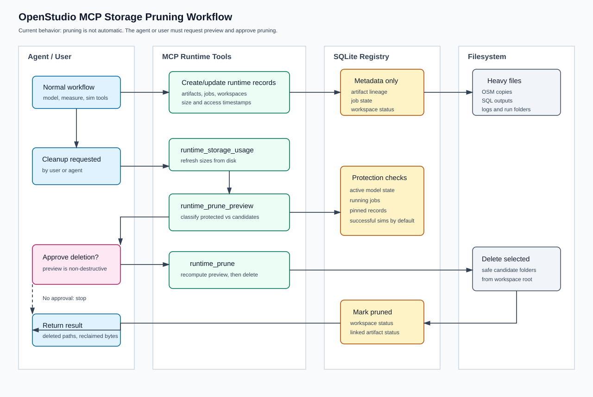
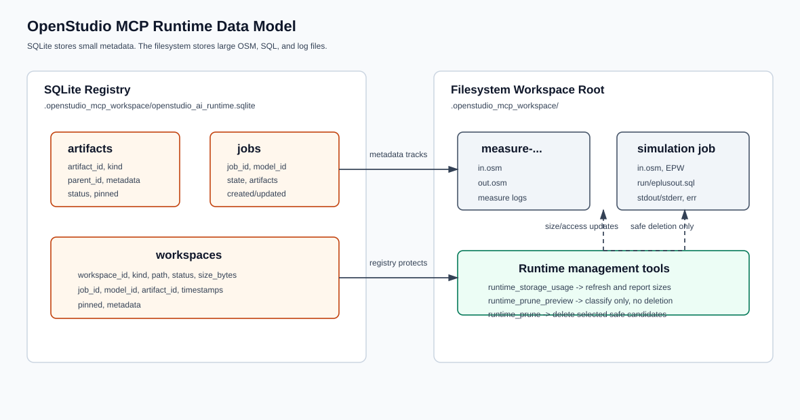

# OpenStudio AI MCP

This package contains the OpenStudio AI MCP server.

Main surfaces:

- `simulation/`: async, sandboxed, parallel simulation workflow surface.
- `results/`: SQL-backed result retrieval surface.
- `measures/`: MCP-published deterministic measures.
- `tools/`: current model, simulation, results, and SDK-doc tool handlers.
- `runtime/`: SQLite-backed local runtime registry, workspace management,
  artifact tracking, job tracking, and measure registry support.
- `sdk_docs/`: current SDK documentation lookup implementation.

Imports should use `examples.openstudio_ai.openstudio_mcp`.

## Local Runtime Persistence

The MCP server stores runtime metadata in a lightweight SQLite database under
the configured workspace root:

```text
.openstudio_mcp_workspace/
├── openstudio_ai_runtime.sqlite
├── measure-.../
└── <simulation-job-id>/
```

SQLite stores metadata only:

- artifact records and lineage;
- job records and status;
- workspace records, size, kind, status, and timestamps;
- pin/protection status for future retention policies.

Large files remain on disk in workspaces:

- OSM model copies;
- EnergyPlus SQL files;
- stdout/stderr and simulation logs.

## Runtime Storage Tools

The MCP server exposes runtime management tools:

- `runtime_storage_usage`: report registered workspace usage and unregistered
  directories.
- `runtime_prune_preview`: list prune candidates without deleting files.
- `runtime_prune`: delete safe prune candidates.

Pruning is explicit. The MCP server does not automatically delete workspaces
during normal model, measure, simulation, or result-query workflows. Cleanup is
initiated only when the agent calls the runtime storage tools or when the user
asks the agent to inspect and prune local storage. The intended flow is:

1. The agent or user requests storage inspection.
2. The agent calls `runtime_storage_usage`.
3. The agent calls `runtime_prune_preview` and shows the protected workspaces,
   candidate workspaces, and reclaimable bytes.
4. The user or agent policy approves deletion.
5. The agent calls `runtime_prune`.

Default prune behavior is conservative:

- active model workspaces are protected;
- running jobs are protected;
- pinned workspaces are protected;
- successful simulation workspaces are protected unless explicitly requested;
- unprotected measure workspaces and failed simulation workspaces may be pruned.



The data model is split intentionally: SQLite stores small metadata and the
filesystem stores large runtime files. SQLite is the source of truth for what a
workspace is, why it exists, and whether it can be pruned. It does not store OSM
models, EnergyPlus SQL files, or logs as blobs.


